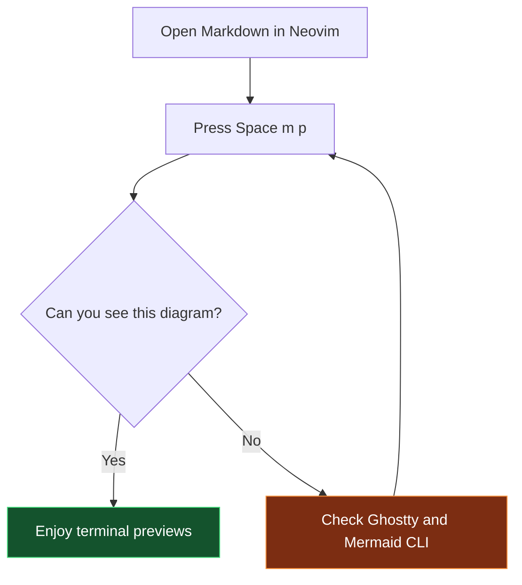
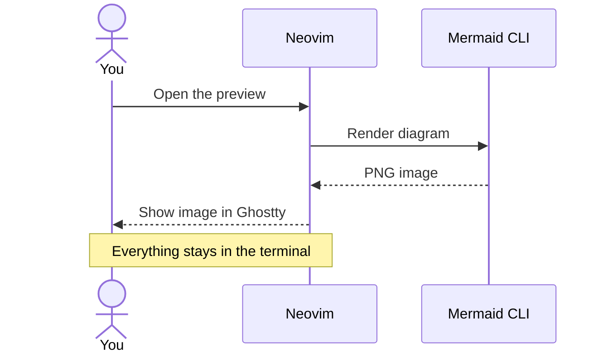
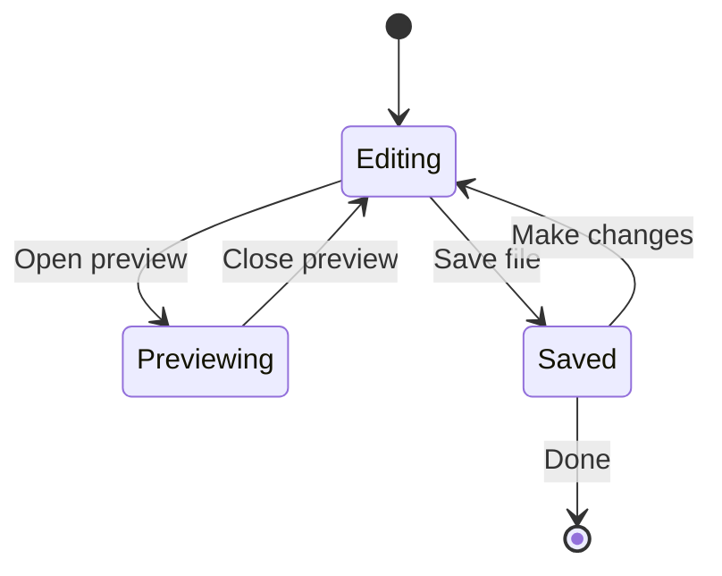
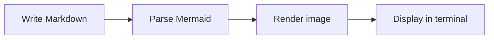

# Mermaid preview test

Press `Space m p` to preview this file, then `q` or `Esc` to close.
For a live preview beside the source, run `:vert MdRender split`.
Try changing a label below while the split is open.

## Flowchart

You should see a decision diamond, two branches, and colored end states.

## Sequence diagram

You should see three participants, arrows, and a highlighted note.

## State diagram

You should see an edit-and-preview cycle with start and end markers.

## Left-to-right layout

This wider diagram checks labels and layout in a narrow split.

